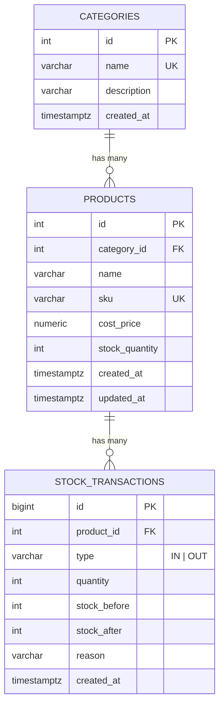

# ER Diagram - Inventory Management System

## แผนภาพ

## คำอธิบายตาราง

### categories
จัดกลุ่มสินค้า เช่น IT, Office Supply, Furniture
- `name` ห้ามซ้ำ (UNIQUE)

### products
- `sku` ห้ามซ้ำ (UNIQUE)
- `cost_price` ต้อง >= 0
- `stock_quantity` ต้อง >= 0 (CHECK constraint เป็นด่านป้องกันสุดท้ายในระดับฐานข้อมูล นอกเหนือจาก logic ใน API)
- `category_id` อ้างอิง categories (ลบหมวดหมู่ที่ยังมีสินค้าไม่ได้ ด้วย `ON DELETE RESTRICT`)

### stock_transactions
บันทึกประวัติการเพิ่ม/ลดสต็อก (ไม่แก้ไข ไม่ลบ เพิ่มอย่างเดียว เหมือน ledger)
- `type`: `IN` (เพิ่ม) หรือ `OUT` (ลด)
- `quantity`: จำนวนที่เปลี่ยน เป็นค่าบวกเสมอ ทิศทางดูจาก `type`
- `stock_before` / `stock_after`: สต็อกก่อนและหลังทำรายการ ช่วยตรวจสอบย้อนหลังได้ง่าย
- `reason`: เหตุผลสั้นๆ
- `created_at`: วันที่-เวลา

## ความสัมพันธ์ (One-to-Many)

| ฝั่ง One | ฝั่ง Many | ความหมาย |
|---|---|---|
| categories | products | หนึ่งหมวดหมู่มีได้หลายสินค้า สินค้าหนึ่งชิ้นอยู่ได้หนึ่งหมวดหมู่ |
| products | stock_transactions | หนึ่งสินค้ามีได้หลายรายการเคลื่อนไหว แต่ละรายการเป็นของสินค้าเดียว |

## ข้อตัดสินใจในการออกแบบ

1. **เก็บ `stock_quantity` ไว้ในตาราง products** (denormalized) แทนการ SUM จาก transactions ทุกครั้ง เพื่อให้ดึงรายการ low-stock ได้เร็ว โดยอัปเดตในทรานแซกชันเดียวกับการ insert transaction เพื่อให้สองค่านี้ตรงกันเสมอ
2. **เก็บ `stock_before` / `stock_after`** เพื่อให้ audit ได้ว่ายอดไม่ตรงตั้งแต่รายการไหน
3. **Index `(product_id, id DESC)`** รองรับการดูประวัติของสินค้าเรียงจากใหม่ไปเก่า (เรียงตาม `id` เพราะ `id` ถูกสร้างหลังได้ lock แถวสินค้า จึงตรงกับลำดับจริงแม้มีคำขอพร้อมกัน ส่วน `created_at` คือเวลาเริ่ม transaction)
4. **Index `stock_quantity`** รองรับ query low-stock